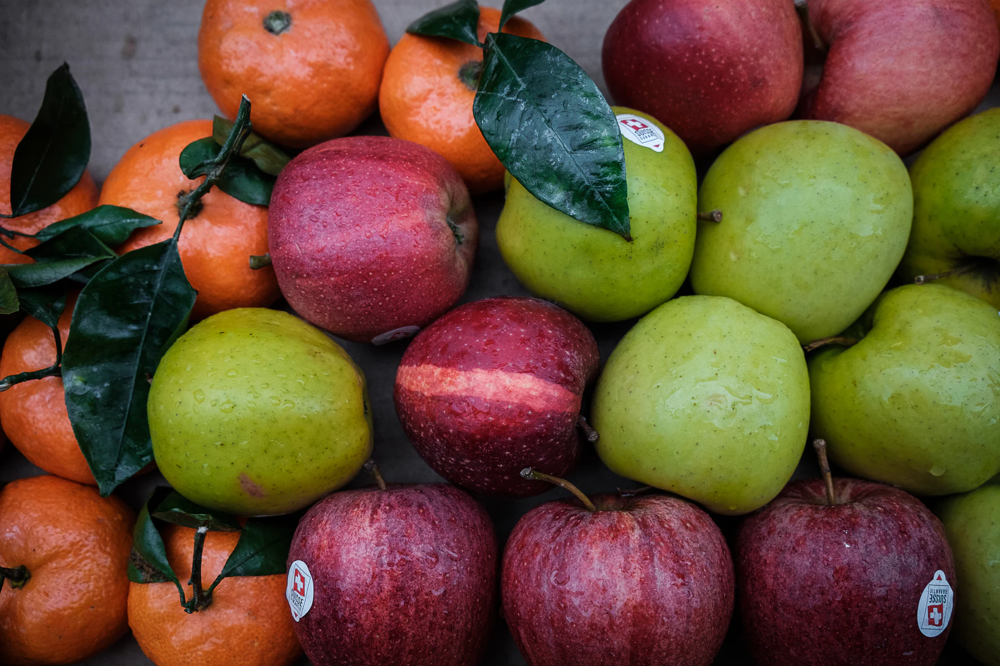
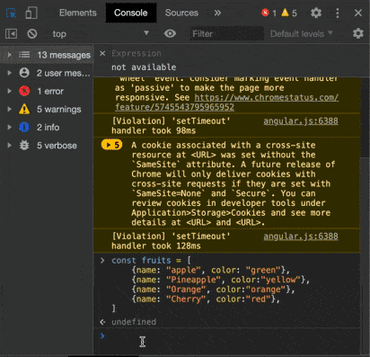

## Objectifs

* Créer des objets littéraux
* Lire et écrire des propriétés sur les objets

## Pré-requis

Avoir validé les ressources suivantes :

[Voir la ressource "JS Basics 01 - Qu'est-ce que JavaScript"](https://simplonco.github.io/dev-web-js-basics-01-qu-est-ce-que-javascript/)

[Voir la ressource "JS Basics 02 - Syntaxe et concepts de base"](https://simplonco.github.io/dev-web-js-basics-02-syntaxe-et-concepts-de-base/)

[Voir la ressource "JS Basics 03 - Les variables"](https://simplonco.github.io/dev-web-js-basics-03-les-variables/)

[Voir la ressource "JS Basics 04 - Les types de données"](https://simplonco.github.io/dev-web-js-basics-04-les-types-de-donnees/)

[Voir la ressource "JS Basics 05 - Les instructions conditionnelles"](https://simplonco.github.io/dev-web-js-basics-05-les-instructions-conditionnelles/)

[Voir la ressource "JS Basics 06 - Les fonctions"](https://simplonco.github.io/dev-web-js-basics-06-les-fonctions/)

[Voir la ressource "JS Basics 07 - Les tableaux"](https://simplonco.github.io/dev-web-js-basics-07-les-tableaux/)

[Voir la ressource "JS Basics 08 - Les boucles"](https://simplonco.github.io/dev-web-js-basics-08-les-boucles/)

## Introduction

Dans les ressources précédentes, tu as **découvert ce qu'est JavaScript et à quoi ressemble la syntaxe**.

Nous avons aussi appris à **créer des variables et les différents types de données que nous pouvons utiliser en JavaScript**.
Nous avons également appris à **créer et à manipuler des tableaux.**

Dans cette ressource, nous verrons **comment créer et manipuler des objets en JavaScript.**

**C'est parti!**

## Que sont les objets ?



Les objets en Javascript sont comme les objets qui t'entourent.

Ce sont des sortes de conteneurs, qui contiennent des propriétés qui caractérisent l'objet.

Par exemple, prenons une pomme.

Une pomme a une couleur verte (*"#00FF00"*), un diamètre de 10cm, etc, etc.

Essayons de décrire une pomme en JavaScript !

```javascript
const apple = {
  color: "#00FF00",
  diameter: 10,
  isEaten: false,
  vitamins: ["A", "B1", "B2", "B6", "C"],
  variety: { code: 576, name: "Granny Smith" },
  gather: function () {
    return "Here's one apple!";
  }
};
```

Les objets sont créés à l'aide d'accolades (*🇬🇧 curly braces*) : `{}`.

A l'intérieur de l'objet, on peut créer des **clés** (*ex : color)* et associer à ces clés des **valeurs** en séparant clé et valeur par `:`.

Chaque paire clé/valeur doit être séparée par une virgule.

La valeur que tu mets peut être n'importe quel type de données JavaScript.

Par exemple, comme une pomme peut être source de **plusieurs vitamines**, on a utilisé un tableau pour les représenter.

Comme tu peux le voir, un objet peut être imbriqué dans autre objet ! Ici, notre pomme appartient à une variété représentée par un objet.

Nous avons aussi donné à la pomme une **fonction (appelée méthode)** pour cueillir le fruit !

## Accéder aux propriétés d'un objet

Nous pouvons accéder à une propriété de l'objet en utilisant `.` ou `[]`.

Par exemple, si nous voulons accéder a la propriété `color` de l'objet `apple`, il suffit d'écrire `apple.color` ou `apple['color']`.

```javascript
apple.color;
// "#00FF00"
apple['color'];
// "#00FF00"
```

La plupart du temps, tu utiliseras un point pour accéder à une propriété (`apple.color`), mais les **crochets peuvent aussi être très utiles** par exemple dans le cas où tu souhaites **utiliser une variable pour accéder à une valeur.**

```js live console
const apple = {
  color: "#00FF00",
  diameter: 10,
  isEaten: false,
  vitamins: ["A", "B1", "B2", "B6", "C"],
  variety: { code: 576, name: "Granny Smith" },
  gather: function () {
    return "Here's one apple!";
  }
};
let selectedProperty = "color";
//selectedProperty = prompt('Tape la propriété que tu veux afficher') ;
console.log(apple[selectedProperty]) ;
```

Décommente la ligne `//selectedProperty = prompt(…` pour saisir et tester une autre propriété.
{:.alert-info}

**🔬 Expérimente**

- Crée un objet `billyTheCat`
  - il doit avoir une propriété `name`,
  - une propriété `color`,
  - une propriété `favouriteFoods` (un tableau avec plusieurs entrées),
  - une propriété `isHungry` définie à true
  - et une méthode `meow` qui imprime "Meooow" dans la console

- Ensuite, crée une variable `selectedProperty` et, à l'aide de prompt, demande à l'utilisateur de choisir la propriété de l'objet qu'il veut afficher.

- Enfin, utilise console.log pour afficher la bonne propriété (en utilisant des crochets `[]`).

```js live console
const billyTheCat = {
//...
};
```

Clique sur play pour lancer le code. Tu peux aussi changer le code pour tester des choses par toi-même
{:.alert-info}

<details markdown="1">
<summary>Voir la solution</summary>

```javascript
const billyTheCat = {
  name: "Billy",
  color: "Ginger",
  favouriteFoods: ["Fish", "Chicken"],
  isHungry: false,
  meow: function () {
    console.log("Meoooow")
  }
};

const selectedProperty = prompt("Select a property");
console.log(billyTheCat[selectedProperty]);
```

</details>

### Ajouter ou modifier la propriété d'un objet

Pour ajouter une propriété à un objet, il suffit de la définir comme ceci :

```js console
const apple = {
  color: "#00FF00",
  diameter: 10,
  isEaten: false,
  vitamins: ["A", "B1", "B2", "B6", "C"],
  variety: { code: 576, name: "Granny Smith" },
  gather: function () {
    return "Here's one apple!";
  }
};

apple.growsOn = "Tree" ;

console.log(apple)
```

De même, pour donner une autre valeur à la propriété d'un objet, il suffit d'utiliser le symbole égal `=`.

```javascript
apple.color = "Red" ;
```

### Supprimer une propriété

On peut utiliser `delete` pour supprimer une propriété.

```js console
const apple = {
  color: "#00FF00",
  diameter: 10,
  isEaten: false,
  vitamins: ["A", "B1", "B2", "B6", "C"],
  variety: { code: 576, name: "Granny Smith" },
  gather: function () {
    return "Here's one apple!";
  }
};

delete apple.variety.name;
console.log(apple)
```

## Combiner des tableaux et des objets

Et si nous pouvions **combiner des tableaux avec des objets?**

Par exemple, nous avons beaucoup de fruits différents, pas seulement des pommes.
Et si nous voulions décrire **tous les fruits?**

Et bien, nous pourrions mettre nos objets dans un tableau !

```javascript
const fruits = [
  { name: "apple", color: "green" },
  { name: "Pineapple", color:"yellow" },
  { name: "Orange", color:"orange" },
  { name: "Cherry", color:"red" },
];
```

**🔬 Expérimente**

Crée un tableau d'objets `animals`, le tableau doit contenir différents animaux, leur nom, leur espèce et leur son.
(ex. pour un animal : name: **Billy**, species: **Cat**, sound: **Meow**)

**Bonus:**
Utilise une boucle pour afficher le son de chaque animal dans la console.

```js live console

```

<details markdown="1">
<summary>Voir la solution</summary>

```javascript
const animals = [
  { name:"Billy", species:"Cat", sound:"Meow" },
  { name:"Bob", species:"Dog", sound:"Woof" },
  { name:"Jimmy", species:"Squirrel", sound:"Chit" },
];

for (let i = 0; i < animals.length; i++) {
  console.log(animals[i].sound);
}
```

</details>

## Objets dans la console du navigateur

Essaie d'afficher ce tableau d'objets dans la console du navigateur, tu devrais pouvoir naviguer en cliquant sur les petites flèches à gauche.



### What is "this" ?

Le mot-clé `this` se réfère à l'objet courant sur lequel la méthode est appelée. Plus précisément, **`this` désigne ce qui précède le `.` lors de l'appel d'une méthode.**

Voyons un exemple concret :

```javascript
const person1 = {
  name: "Bob",
  age: 30,
  sayHello: function () {
    console.log(`Hi, I'm ${this.name}`);
  }
};

person1.sayHello();
// Puisque "this" à la line 5 se réfère à ce qui précède le "." à la line 9 (person1),
// "this.name" vaudra "Bob", donc la méthode affichera "Hi, I'm Bob"
```

Voyons un exemple plus avancé :

```js
const pomme = {
  nom: 'Pomme',
  isEaten: false,

  eat: function() {
    if (this.isEaten) {
      console.log('Cette pomme a déjà été mangée !');
    } else {
      this.isEaten = true;
      console.log('Miam ! Vous venez de manger la pomme.');
    }
  }
};

// Exemples d'utilisation :
pomme.eat();
// Affiche : "Miam ! Vous venez de manger la pomme."

pomme.eat();
// Affiche : "Cette pomme a déjà été mangée !"

console.log(pomme.isEaten);
// Résultat : true
```

Prends le temps de regarder le code et essaie de le comprendre.

Ce qui se passe dans ce code, c'est que notre pomme a un état, **isEaten** qui est `false` par défaut.

Lorsqu'on invoque la méthode **eat** on vérifie si le fruit a déjà été mangé, si oui, alors on affiche que le fruit a déjà été mangé, si non, on change la valeur de `isEaten` en true.

Ne t'inquiète pas si cela n'est pas clair à 100% pour le moment, nous en parlerons plus tard.

**🔬 Expérimente**

Billy the Cat est de retour, essaye d'implémenter une méthode `feed` qui change la valeur de `isHungry` en `false` quand on l'invoque.

La méthode doit vérifier la valeur de `isHungry`, si Billy n'a pas faim, elle devrait afficher que Billy n'a pas faim dans la console; s'il a faim, elle devrait changer le booléen pour qu'il soit `false`.

```js live console
const  billyTheCat = {
  name: "Billy",
  species: "Cat",
  isHungry: true,
  feed:function(){
    // Solution goes here
  }
}

```

<details markdown="1">
<summary>Voir la solution</summary>

```javascript
const  billyTheCat = {
  name: "Billy",
  species: "Cat",
  isHungry: true,
  feed: function () {
    if (this.isHungry) {
      this.isHungry = false;
      console.log(`${this.name} is  eating...`);
    } else {
      console.log(`${this.name} is not hungry`);
    }
  }
};

billyTheCat.feed();
billyTheCat.feed();
```

</details>

## En JavaScript, tous les objets sont uniques

**Les opérateurs d'égalité appliqués aux objets ne comparent pas ce qui se trouve à l'intérieur des objets, mais plutôt les endroits en mémoire où les objets sont stockés**.

Si tu prends deux objets, avec exactement les mêmes paires clé/valeur, ils ne seront jamais considérés comme "égaux" avec les opérateurs `===`, `!==`, `==` ou `!=`.

```javascript
console.log({} === {});
// false
console.log({ name: "Billy", species:"Cat" } === { name: "Billy", species:"Cat" });
// false
console.log({ name: "Billy", species:"Cat" } == { name: "Billy", species:"Cat" });
// false
```

A chaque fois que nous écrivons `{}` pour décrire un objet, l'interpréteur Javascript ira créer un nouvel objet en mémoire**, c'est pourquoi on peut dire qu'en JS, chaque objet est "unique".

## Résumé

- Un objet en JavaScript est un conteneur qui peut avoir un ensemble de paires "clé/valeur"
- Tu peux accéder à la propriété d'un objet en utilisant le point `.` ou les crochets `[]`.
- Tous les objets sont uniques, même s'ils ont les mêmes propriétés et méthodes
- Tu peux créer ou modifier une propriété en lui attribuant le symbole égal `=`.
  ex: `apple.color = "red"`

## Ressources

**MDN - Travailler avec des objets**

Belle ressource avec des explications claires sur les objets

[Lien vers la ressource](https://developer.mozilla.org/fr/docs/Web/JavaScript/Guide/Utiliser_les_objets)
{:.alert-info}

**Javascript.info - Objets**

Très bonne ressource, information claire et facile à lire

[Lien vers la ressource](https://javascript.info/object)
{:.alert-info}